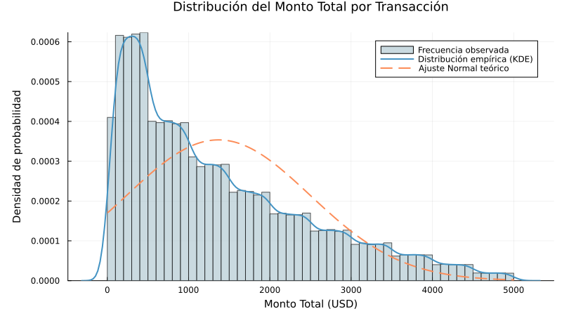
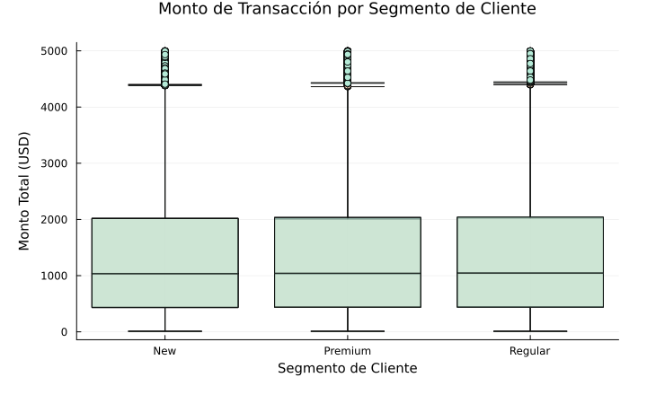
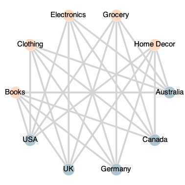

# SaleSight — Reporte Ejecutivo

**Cliente:** Firma de Retail Global  
**Periodo analizado:** Enero 2023 – Diciembre 2024  
**Preparado por:** Stiven Posada Casadiego · Josué Ribero Duarte  
**Equipo:** SaleSight Consultoría de Datos  

---

## ¿Qué analizamos?

Procesamos **302,010 transacciones de ventas** distribuidas en 5 países (Australia, Canada, Germany, UK y USA) y 5 categorías de producto (Books, Clothing, Electronics, Grocery y Home Decor). Los datos estaban en excelente estado: más del 99% de los registros se conservaron tras la limpieza.

---

## ¿Qué encontramos?

### 1. Su negocio es más simple de lo que parece

Aunque el dataset registra 30 variables por transacción, **solo 4 de ellas concentran el 98.7% de toda la variación** del negocio. La variable más importante es el **monto total de la transacción** (`Total_Amount`), seguida de la edad del cliente y la cantidad de artículos comprados. Esto significa que con un tablero de 4 métricas bien elegidas puede monitorear prácticamente todo lo que ocurre en su negocio.

### 2. El ticket promedio es estable entre segmentos

El monto promedio por transacción ronda los **$1,367 USD** en todos los segmentos:
- Clientes **New**: $1,368 promedio
- Clientes **Premium**: $1,363 promedio
- Clientes **Regular**: $1,369 promedio

La diferencia entre el segmento Premium y Regular es de apenas **$5.87 USD** y la prueba estadística confirma que esa diferencia **no es significativa** (p-valor = 0.271). En la práctica, los tres segmentos gastan lo mismo por transacción.

> **Implicación:** La segmentación actual no está capturando diferencias reales de comportamiento de gasto. Considere enriquecer los criterios de segmentación con frecuencia de compra o valor de vida del cliente (LTV).

### 3. Las calificaciones numéricas son un indicador confiable de satisfacción

La regla `calificación ≥ 4 estrella → cliente satisfecho` predice correctamente la satisfacción real (basada en comentarios escritos) en el **84.2% de los casos**, con un F1-Score de 0.862.

> **Implicación:** Puede implementar este indicador automático en su tablero de control para monitorear satisfacción en tiempo real, sin necesidad de revisar comentarios de texto individualmente.

### 4. La red comercial tiene puntos de fallo críticos

Su red comercial (países × categorías de producto) tiene **25 conexiones activas** y está completamente interconectada. Sin embargo, los mercados de **Australia, Canada y Germany** concentran el mayor número de conexiones: si los tres fallan simultáneamente, el **60% de las relaciones comerciales** de la red quedan afectadas.

---

## ¿Qué recomendamos?

| Prioridad | Acción | Base del hallazgo |
|:---:|---|---|
| **Alta** | Desarrollar criterios de segmentación más robustos (frecuencia, LTV, canal) | Los 3 segmentos actuales tienen gasto idéntico |
| **Alta** | Implementar plan de contingencia para Australia, Canada y Germany | Nodos críticos de la red — 60% de impacto acumulado |
| **Media** | Activar monitoreo automático de satisfacción con `Ratings ≥ 4` | Exactitud del 84.2% como indicador de satisfacción |
| **Media** | Simplificar el sistema de reportes a 4 métricas clave | El 98.7% de la variación se explica con 4 componentes |
| **Baja** | Explorar oportunidades de especialización por país y categoría | La red actual es homogénea — no hay diferenciación geográfica |

---

## Visualizaciones de referencia

### 1. Distribución del monto por transacción
*Sección 3.2 del notebook — Análisis estadístico*

Los montos de compra siguen un patrón predecible centrado en **$1,367 USD**. La curva azul (distribución real) coincide con el ajuste teórico (línea punteada naranja), lo que confirma que el comportamiento de gasto es uniforme y estable.

---

### 2. Gasto por segmento de cliente
*Sección 3.4 del notebook — Comparación entre grupos*

Los tres segmentos (New, Premium y Regular) presentan distribuciones prácticamente idénticas. Las cajas se superponen completamente, evidenciando que el programa de segmentación actual no diferencia el comportamiento de gasto real entre clientes.

---

### 3. Red comercial País × Categoría
*Sección 4.5 del notebook — Análisis de red*

Los nodos azules representan mercados geográficos y los naranjas representan categorías de producto. El tamaño de cada nodo es proporcional a sus conexiones activas. Los mercados de mayor tamaño (Australia, Canada, Germany) son los puntos críticos cuya falla afectaría el 60% de la red.

---

*Reporte generado por SaleSight · Consultoría de Datos*
